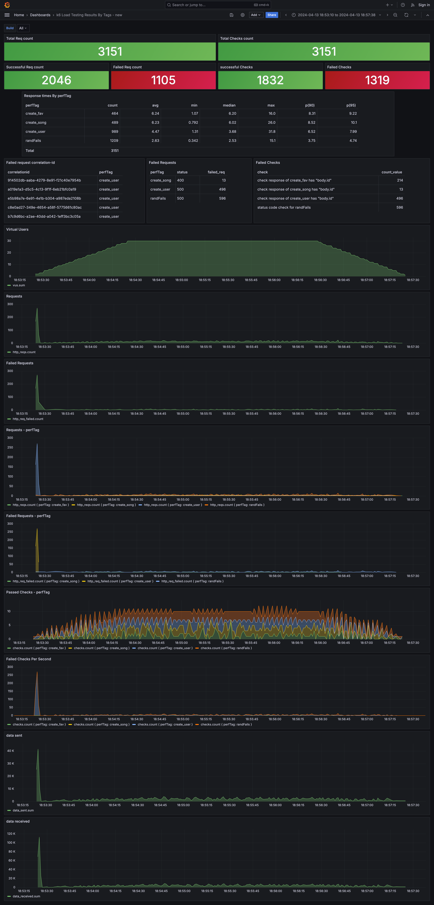

# Template for performance testing with K6
This is template for peeps trying to setup performance tests with K6 and result dashboard in Grafana. 

[xk6-output-influxdb](https://github.com/grafana/xk6-output-influxdb) extension is used for pushing metrics to influxdb v1 (influxQL). 

### Setup and Running test
1. Bring up Application Under Test, Postgres, Grafana and influxDB 

    `docker-compose up -d`

    Grafana is mapped to port 3000
    InfluxDB is mapped tp port 8086
    AUT runs on port 4000. Refer "Application Under Test" section for more information
    AUT uses postgress which is mapped to port 5432

2. To access Grafana dashboard, open `http://localhost:3000

3. To run sample performance test
    `./run.sh`

    Sample performance script is placed under `./scripts` folder `fav.js` along with test data.

### Types of Tests K6 Can Perform
Using K6 we can perform Smoke Testing, Load testing, Stress testing, Spike Testing, Breakpoint Testing, Soak Testing.To have a reference on how to write the test scripts for these types of performance tests, We have Created sample scripts for each of this testing under `./scripts/performance-tests` folder for reference. You can also learn more about these tests under the documentation provided below.
1. Smoke Test       : https://grafana.com/blog/2024/01/30/smoke-testing/
2. Average Load Test: https://grafana.com/blog/2024/01/30/average-load-testing/#average-load-testing-in-k6
3. Stress Test      : https://grafana.com/blog/2024/01/30/stress-testing/#stress-testing-in-k6
4. Spike Test       : https://grafana.com/blog/2024/01/30/spike-testing/#spike-testing-in-k6
5. BreakPoint Test  : https://grafana.com/blog/2024/01/30/breakpoint-testing/
6. Soak Test        : https://grafana.com/blog/2024/01/30/soak-testing/

How to Run these tests: Use the command `k6 run <filename.js>`
### Note: Please do not run Breakpoint or Soak test on the sample application provided as it may have higher loads on the application. These tests are for reference only and need to be used on your own application where necessary.

### Grafana dashbaord
1. We rely on the tags for pulling performance metrics from influxdb. 
2. You can select "Build" in grafana dashboard to filter results of a specific test run. Build id is timestamp when test is triggered.  You can refer `fav.js` for implementation. Dashboard and datasource are auto imported during docker-compose up.



### Application Under Test
We build a "simple dummy application" with few rest endpoint for hosting local. By no means this is a standard or meaning, this is simply a dummy application! We have few issues introduced to simulate errors. 

Below are endpoints
1. create user

    `curl -X POST http://localhost:4000/user -H "Content-Type: application/json" -d "{\"name\": \"Dileep\"}"`
2. Get all users
    `curl http://localhost:4000/user`
3. Create a song

    `curl -X POST http://localhost:4000/song -H "Content-Type: application/json" -d "{\"name\": \"kim kim\", \"duration\": 100}"`
4. Get all songs

    `curl http://localhost:4000/song`
5. Add song as fav to user

    `curl -X POST http://localhost:4000/fav -H "Content-Type: application/json" -d "{\"song_id\": \"1\", \"user_id\":\"1\"}"`
6. Get all favs

    `curl http://localhost:4000/fav`


`test-data-generator` folder has sample code used to 

Notes: 
1. To clear the data in postgres (to avoid error from endpoints) clear data in all tables
    ```
    truncate "user" cascade;
    truncate "song" cascade;
    truncate "FavSong" cascade;
    ALTER SEQUENCE "FavSong_id_seq" RESTART WITH 1;
    ALTER SEQUENCE song_id_seq RESTART WITH 1;
    ALTER SEQUENCE user_id_seq RESTART WITH 1;
    ```